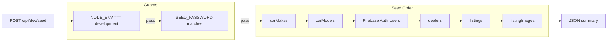

# Dev Seeder API Plan

## Summary

Implement a POST-only API at `app/api/dev/seed/route.ts` that seeds all Firestore collections. The route runs only when `NODE_ENV === "development"` and requires a password (from `SEED_PASSWORD` env) in the request.

---

## Architecture




---

## 1. API Route: `app/api/dev/seed/route.ts`

**Path**: [app/api/dev/seed/route.ts](app/api/dev/seed/route.ts)

**Behavior**:

- **Method**: POST only (GET returns 405)
- **Dev guard**: If `NODE_ENV !== "development"`, return `404` (route appears non-existent in prod)
- **Password auth**: Require `password` in JSON body or `X-Seed-Password` header. Compare with `process.env.SEED_PASSWORD`. If missing or mismatch, return `401`
- **Idempotency**: Use `set` with merge or check existence before seeding to allow re-running without duplicates (or document that re-run will add more data)

**Request**:

```json
POST /api/dev/seed
Content-Type: application/json
{ "password": "your-seed-password" }
```

Or: `X-Seed-Password: your-seed-password`

**Response**:

```json
{
  "ok": true,
  "seeded": {
    "carMakes": 10,
    "carModels": 45,
    "users": 2,
    "dealers": 2,
    "listings": 5,
    "listingImages": 3
  }
}
```

---

## 2. Firebase Admin Firestore

Add Firestore to the admin module for server-side Firestore writes.

**File**: [lib/firebase/admin.ts](lib/firebase/admin.ts)

- Import `getFirestore` from `firebase-admin/firestore`
- Export `adminFirestore` (or `getAdminFirestore()`) using the same `getApp()` instance
- This ensures Firestore writes use the Admin SDK (server-only, no client SDK in seed route)

---

## 3. Seed Data

**File**: `lib/seed/data.ts` (or inline in route if small)

**Collections and sample data**:


| Collection                | Sample data                                                                  | Notes                                                                     |
| ------------------------- | ---------------------------------------------------------------------------- | ------------------------------------------------------------------------- |
| **carMakes**              | Toyota, Honda, Mitsubishi, Nissan, Isuzu, Ford, Hyundai, Suzuki, Kia, Mazda  | `id` (number), `name`                                                     |
| **carModels**             | Vios, Camry, Civic, City, Mirage, Lancer, Navara, Terra, D-Max, Ranger, etc. | `id`, `makeId`, `name`; link to makes                                     |
| **users** (Firebase Auth) | 2 demo sellers: `seller1@dev.local`, `seller2@dev.local`                     | `adminAuth.createUser()` with password; set custom claim `role: "seller"` |
| **dealers**               | 2 dealers linked to `userId` from created users                              | `dealershipName`, `location`, etc.                                        |
| **listings**              | 5–10 sample listings                                                         | `dealerId`, `modelId`, `year`, `price`, `mileage`, etc.                   |
| **listingImages**         | 1–3 images per listing                                                       | `listingId`, `imageUrl` (placeholder URLs or `https://placehold.co/...`)  |


**Dependencies**:

- Dealers require `userId` from created Firebase Auth users
- Listings require `dealerId` from created dealers
- ListingImages require `listingId` from created listings

**IDs**:

- `carMakes` / `carModels`: Use numeric `id` (1, 2, 3…) in document; Firestore doc IDs can be auto-generated or `make-1`, `model-1` etc.
- `dealers`, `listings`, `listingImages`: Use Firestore auto-generated IDs

---

## 4. Environment Variables

**File**: [.env.example](.env.example)

Add:

```
# Dev seeder (only used when NODE_ENV=development)
SEED_PASSWORD=
```

**Usage**: Developer sets `SEED_PASSWORD` in `.env.local` (e.g. `SEED_PASSWORD=dev-seed-2024`). Never commit this value.

---

## 5. Implementation Details

### Seed order (respecting foreign keys)

1. **carMakes** – no dependencies
2. **carModels** – depends on `makeId` from carMakes
3. **Firebase Auth users** – create 2 users, store `uid` for dealers
4. **dealers** – `userId` from step 3
5. **listings** – `dealerId` from step 4, `modelId` from step 2
6. **listingImages** – `listingId` from step 5

### Idempotency

- **carMakes / carModels**: Use `doc().set()` with `merge: true` or query by `id` and skip if exists. Avoid duplicate IDs.
- **Users**: Check `getUserByEmail()` before create; skip if exists.
- **dealers / listings / listingImages**: Each run can append; or clear collections first (optional, more destructive).

### Firestore document structure

Match existing schemas:

- **carMakes**: `{ id: number, name: string }` – store in doc with `id` field; doc ID can be `make-${id}` for consistency
- **carModels**: `{ id: number, makeId: number, name: string }`
- **dealers**: `{ userId, dealershipName, location?, isVerified, createdAt }`
- **listings**: `{ dealerId, modelId, year, price, mileage?, transmission?, fuelType?, location?, description?, status, isFeatured, createdAt, updatedAt }`
- **listingImages**: `{ listingId, imageUrl, isPrimary }`

---

## 6. Files to Create/Modify


| File                                                   | Action                                        |
| ------------------------------------------------------ | --------------------------------------------- |
| [lib/firebase/admin.ts](lib/firebase/admin.ts)         | Add `getFirestore` export from firebase-admin |
| [app/api/dev/seed/route.ts](app/api/dev/seed/route.ts) | Create (POST handler, guards, seed logic)     |
| [lib/seed/data.ts](lib/seed/data.ts)                   | Create (seed data constants)                  |
| [.env.example](.env.example)                           | Add `SEED_PASSWORD`                           |


---

## 7. Optional: Clear Before Seed

If you want a clean slate each run, add a `?clear=true` query param that deletes all documents in the seeded collections before inserting. Document this clearly.

---

## 8. Execution

Developer runs:

```bash
curl -X POST http://localhost:3000/api/dev/seed \
  -H "Content-Type: application/json" \
  -d '{"password":"dev-seed-2024"}'
```

Or from browser console / Postman with the same request.