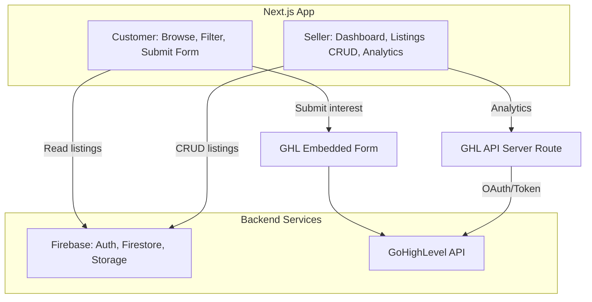

# Gensan Car Buy and Sell - Next.js Project Plan

## Architecture Overview



---

## 1. Project Setup

**Initialize Next.js 15** with App Router, TypeScript, Tailwind CSS, and ESLint.

- **UI framework**: Use **shadcn/ui** for all UI components (buttons, inputs, cards, badges, selects, forms, tables, etc.). Run `npx shadcn@latest init` after project creation, then add components as needed via `npx shadcn@latest add <component>`
- **Key dependencies**: `next`, `react`, `firebase`, `zod`, `@tanstack/react-query` (client-side caching), `next-themes` (optional dark mode)
- **Config**: `next.config.ts` with image domains for Firebase Storage
- **Environment**: `.env.local` for Firebase config and GHL API credentials (never expose GHL tokens client-side)

**Firebase setup**:

- Firebase Auth (email/password for sellers)
- Firestore (collections: `users`, `dealers`, `carMakes`, `carModels`, `listings`, `listingImages`)
- Firebase Storage (listing images)

**Schema adjustments** ([schema/index.ts](schema/index.ts)):

- Add optional `ghlLocationId` and `ghlFormEmbedUrl` to `DealerSchema` for flexible GHL mapping
- Add input/creation schemas (omit `id`, `createdAt`, etc.) for form validation
- Keep existing schemas for DB/API responses

---

## 2. Firebase Data Layer

**Firestore collections** (aligned with schema):

| Collection      | Key fields                                                                                                 | Notes                                        |
| --------------- | ---------------------------------------------------------------------------------------------------------- | -------------------------------------------- |
| `users`         | id, email, role, firstName, lastName, phone, isVerified                                                    | Sync with Firebase Auth custom claims        |
| `dealers`       | userId, dealershipName, location, ghlLocationId?, ghlFormEmbedUrl?                                         | One dealer per seller user                   |
| `carMakes`      | id (number), name                                                                                          | Admin-managed reference data                 |
| `carModels`     | id (number), makeId, name                                                                                  | Admin-managed reference data                 |
| `listings`      | dealerId, modelId, year, price, mileage, transmission, fuelType, location, description, status, isFeatured | Indexed by status, dealerId, modelId         |
| `listingImages` | listingId, imageUrl, isPrimary                                                                             | Stored in Firebase Storage, URL in Firestore |

**Firestore indexes** (for filters):

- `listings`: `status` + `modelId`, `status` + composite (makeId via join), `status` + `price` range, `status` + `location`
- `listings`: `dealerId` + `status` for seller dashboard

**Server-side data layer**:

- `lib/firebase/admin.ts` - Firebase Admin SDK (server-only)
- `lib/firebase/client.ts` - Firebase client SDK
- `lib/firestore/*.ts` - Typed helpers: `getListings`, `getListingById`, `getCarMakes`, `getCarModels`, `createListing`, etc.

---

## 3. Caching and Performance

**Next.js caching**:

- Use `"use cache"` with `cacheLife` (Next.js 15) for listing list, car makes/models
- `revalidate: 60` (1 min) for listing list; `revalidate: 3600` for makes/models
- Force dynamic only for seller dashboard and auth-gated pages

**React Query** (client):

- Cache listing filters, listing detail, and GHL analytics on the client
- Stale-while-revalidate for smoother UX

**Optimizations**:

- `next/image` for all listing images (Firebase Storage URLs)
- Lazy-load GHL embed script
- Minimal JS for customer flow (server-rendered list + client form only)

---

## 4. SEO and Mobile-First

**Metadata** ([Next.js Metadata API](https://nextjs.org/docs/app/api-reference/functions/generate-metadata)):

- `metadataBase` in root layout
- Per-page `title`, `description`, `openGraph`, `twitter`
- JSON-LD for `Product` (car listings) and `LocalBusiness` (dealers)

**Technical SEO**:

- `app/sitemap.ts` - Dynamic sitemap (listings, static pages)
- `app/robots.ts` - Allow crawlers, reference sitemap
- Semantic HTML: `<main>`, `<article>`, `<nav>`, proper headings

**Mobile-first**:

- Tailwind responsive breakpoints (`sm:`, `md:`, `lg:`)
- Touch-friendly tap targets, collapsible filters on mobile
- Core Web Vitals: `next/font`, optimized images, minimal layout shift
- shadcn/ui components are built on Radix UI primitives and are accessible by default

---

## 5. UI Reference (Design Specification)

**Reference image**: [assets/image-aae948e8-336e-4c50-adaa-1fd2da6fa5f8.png](assets/image-aae948e8-336e-4c50-adaa-1fd2da6fa5f8.png) (Buyer Interface left, Seller Interface right)

**Design system**:

- **shadcn/ui** for all UI primitives (Button, Card, Input, Select, Table, Badge, etc.)
- Clean, modern layout with white background
- Accent colors: blue (primary actions, links), orange (primary CTA), grey (secondary text, borders)
- Typography: clear hierarchy, readable body text

---

### 5.1 Buyer Interface (Customer)

**Header search bar** (top of page):

- Horizontal bar with dropdown filters: **All Makes**, **Model**, **Price Range**, **Location**
- Blue **Search** button on the right
- Filters persist to URL for shareable/bookmarkable results

**Featured Listings section**:

- Section heading: "Featured Listings"
- Horizontal scroll/grid of listing cards (3 visible on desktop, responsive on mobile)
- Each card displays:
  - Car image (primary image)
  - Make + model + year (e.g., "Toyota Vios 2018")
  - Price in PHP format (e.g., "P380,000")
  - Specs line: mileage, transmission, location (e.g., "65,000 km, Automatic, GerSan")
  - Blue **View Details** button

**Trust/utility links** (below featured listings):

- ✔ Verified Sellers
- ▲ Car Buying Tips
- Financing Options
- Icon + text, clickable

**Hero banner** ("Find Your Next Car"):

- Full-width banner with scenic background image
- Copy: "200+ Listings", "100% Verified Dealers"
- Large blue **Browse Cars** CTA button

**Additional content**:

- Standalone car image or visual element at bottom (optional)

---

### 5.2 Seller Interface (Dashboard)

**Welcome and KPIs**:

- Greeting: "Welcome, [Dealer Name]!" (e.g., "Welcome, Dealer AutoHub!")
- Three KPI cards in a row:
  - **Active Listings**: count (e.g., 12)
  - **New Leads**: count (e.g., 4) — from GHL
  - **Pending Sales**: count (e.g., 2) — from GHL

**Action buttons** (top right of dashboard):

- Blue **Manage Listings** — navigates to listings list
- Orange **Add New Listing** — navigates to create form

**Recent Leads table**:

- Columns: **Lead ID**, **Car**, **Status**, **Action**
- Lead ID format: e.g., "GS-CAR-001234"
- Car: model + year (e.g., "Honda City 2015")
- Status: colored badge (e.g., "Contacted" green, "Sold" orange, "Inquired" green)
- Action buttons: **Update**, **Mark as Sold**, **View** — interact with GHL API

**Earnings summary**:

- Sales This Month: e.g., "P45,000"
- Referral Commission: e.g., "P5,000"
- Leads Pending: count (e.g., 2)
- Optional car image beside figures

**Important reminder** (grey box):

- Referral fee policy text: "All sales from platform leads are subject to referral fees. Referral Fee: 1% for cars up to P400k, P5,000 for cars above P500k."
- Brown **View Referral Agreement >** link

---

## 6. Customer Flow

**Pages**:

- `/` - Home: header search bar, featured listings, trust links, hero banner, browse CTA
- `/cars` - Listing grid with same filter bar, full listing results
- `/cars/[id]` - Listing detail + GHL form embed + View Details destination

**Filtering**:

- URL query params: `?make=1&model=5&minPrice=500000&maxPrice=1000000&location=General+Santos`
- Server component fetches filtered listings; filters rendered as dropdowns matching UI reference

**Listing card component**:

- Reusable `ListingCard` with image, make/model/year, price (PHP formatted), specs (mileage, transmission, location), View Details button
- Use shadcn `Card` for layout; `Button` for View Details

**GHL form embed**:

- Each listing detail page embeds the dealer's `ghlFormEmbedUrl` (or global fallback)
- Pass listing context via hidden fields or URL params (e.g., `?listing_id=xxx&car=Toyota+Vios+2020`)
- Use GHL JavaScript or iframe embed per [GHL docs](https://help.gohighlevel.com/support/solutions/articles/155000004524-embedding-highlevel-forms-on-non-highlevel-websites)

---

## 7. Seller Flow (Auth Required)

**Auth**: Firebase Auth with custom claims (`role: seller | admin`). Middleware protects `/seller/`_ and `/admin/`_.

**Pages**:

- `/seller` - Dashboard: welcome, KPIs (Active Listings, New Leads, Pending Sales), Manage/Add buttons, Recent Leads table, Earnings summary, Referral reminder
- `/seller/listings` - List of dealer's listings (create, update, archive)
- `/seller/listings/new` - Create listing form (orange Add New Listing CTA destination)
- `/seller/listings/[id]/edit` - Edit listing form
- `/admin` - Admin: manage car makes/models (if role = admin)

**Dashboard components**:

- `KPICards` — Active Listings (Firestore), New Leads (GHL), Pending Sales (GHL); use shadcn `Card`
- `RecentLeadsTable` — Lead ID, Car, Status badge, Update/Mark as Sold/View actions; use shadcn `Table`, `Badge`, `Button`
- `EarningsSummary` — Sales This Month, Referral Commission, Leads Pending (all from GHL)
- `ReferralReminder` — Grey box with policy text and View Referral Agreement link

All UI components should be built using shadcn/ui primitives.

**GHL analytics**:

- API route `app/api/ghl/analytics/route.ts` - Server-side only, uses GHL API with Private Integration Token or OAuth
- Fetch contacts/opportunities filtered by `ghlLocationId` (or custom field if single location)
- Cache response (e.g., 5–15 min) to respect GHL rate limit (100 req/10 sec)
- Map GHL data to: lead count, pending sales count, recent leads table rows, earnings figures

**Listing forms**:

- Create/Edit forms use Zod schemas derived from `ListingSchema` (input variants)
- Build with shadcn `Form` (react-hook-form + zod), `Input`, `Select`, `Textarea`, `Button`
- Fields: model (dropdown from carModels), year, price, mileage, transmission, fuelType, location, description, status, isFeatured, images (upload to Storage)
- Image upload: Firebase Storage, then save URLs to `listingImages`

---

## 8. GHL Integration Details

**Embedded form**:

- Store `ghlFormEmbedUrl` per dealer (or global in env)
- Embed via `<script>` or iframe on listing detail page
- Optional: GHL External Tracking Script in layout for page views

**API integration** (server-only):

- Env vars: `GHL_API_TOKEN` or `GHL_CLIENT_ID` + `GHL_CLIENT_SECRET` for OAuth
- Endpoints: Contacts, Opportunities (see [HighLevel API](https://marketplace.gohighlevel.com/docs/))
- Map dealer to GHL via `ghlLocationId`; if not set, use default location or skip dealer-specific analytics
- Implement retry with exponential backoff for rate limits

---

## 9. File Structure (Proposed)

```
gensan-car-buy-and-sell/
├── app/
│   ├── layout.tsx
│   ├── page.tsx (home)
│   ├── sitemap.ts
│   ├── robots.ts
│   ├── cars/
│   │   ├── page.tsx (list + filters)
│   │   └── [id]/page.tsx (detail + GHL form)
│   ├── seller/
│   │   ├── layout.tsx (auth guard)
│   │   ├── page.tsx (dashboard + analytics)
│   │   ├── listings/
│   │   │   ├── page.tsx
│   │   │   ├── new/page.tsx
│   │   │   └── [id]/edit/page.tsx
│   └── api/
│       ├── ghl/
│       │   └── analytics/route.ts
│       └── listings/... (if needed for mutations)
├── components/
│   ├── ui/ (shadcn components: Button, Card, Input, Select, Table, Badge, etc.)
│   ├── HeaderSearchBar.tsx (All Makes, Model, Price Range, Location + Search)
│   ├── ListingCard.tsx (image, make/model/year, price, specs, View Details)
│   ├── ListingFilters.tsx
│   ├── FeaturedListings.tsx
│   ├── HeroBanner.tsx (Find Your Next Car)
│   ├── TrustLinks.tsx (Verified Sellers, Car Buying Tips, Financing Options)
│   ├── GHLFormEmbed.tsx
│   ├── KPICards.tsx (Active Listings, New Leads, Pending Sales)
│   ├── RecentLeadsTable.tsx (Lead ID, Car, Status, Action)
│   ├── EarningsSummary.tsx
│   ├── ReferralReminder.tsx
│   └── SellerNav.tsx
├── lib/
│   ├── firebase/
│   ├── firestore/
│   ├── ghl/
│   └── auth.ts
├── schema/
│   └── index.ts (extend with input schemas)
└── ...
```

---

## 10. Implementation Order

1. **Scaffold** - Next.js, Firebase, Tailwind, env setup
2. **shadcn/ui** - Run `npx shadcn@latest init`, add components (Button, Card, Input, Select, Table, Badge, Form, etc.) as needed
3. **Schema** - Add input schemas, extend Dealer for GHL fields
4. **Firestore** - Collections, indexes, data helpers
5. **Auth** - Firebase Auth, middleware for seller routes
6. **Customer UI** - Home, listing list with filters, listing detail (build with shadcn components)
7. **GHL form embed** - Component + dealer form URL config
8. **Seller UI** - Dashboard shell, listings CRUD, forms (build with shadcn components)
9. **GHL API** - Analytics route, caching, dashboard wiring
10. **SEO** - Metadata, sitemap, robots, JSON-LD
11. **Polish** - Mobile responsiveness, image optimization, performance

---

## 11. Environment Variables

```
# Firebase
NEXT_PUBLIC_FIREBASE_API_KEY=
NEXT_PUBLIC_FIREBASE_AUTH_DOMAIN=
NEXT_PUBLIC_FIREBASE_PROJECT_ID=
NEXT_PUBLIC_FIREBASE_STORAGE_BUCKET=
NEXT_PUBLIC_FIREBASE_MESSAGING_SENDER_ID=
NEXT_PUBLIC_FIREBASE_APP_ID=
FIREBASE_ADMIN_PRIVATE_KEY=
FIREBASE_ADMIN_CLIENT_EMAIL=

# GHL (server-only)
GHL_API_TOKEN=
GHL_DEFAULT_LOCATION_ID=  # fallback when dealer has no ghlLocationId
```
